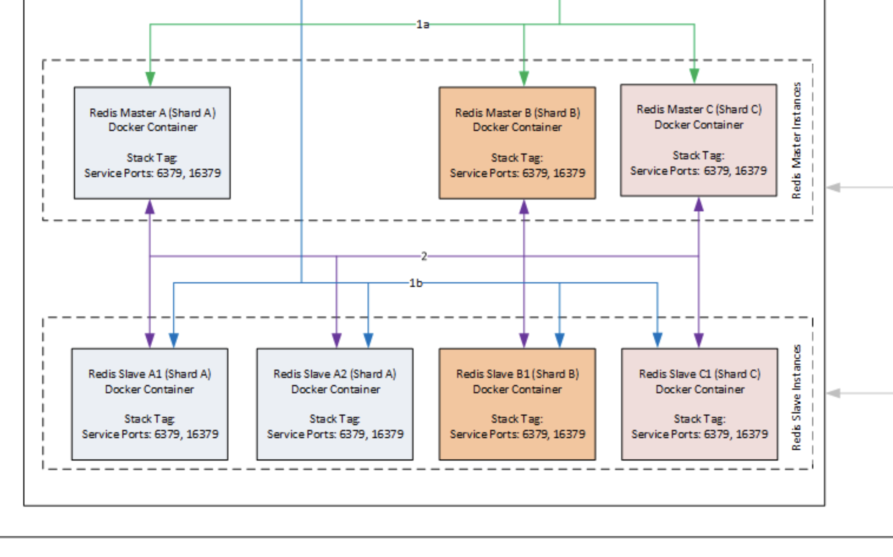

<p align="center">
   </image>
</p>


# Redis Cluster Setup for PP[1-2-3] Environment
The following infrastructure footprint is an initial estimate for PP1, PP2 and PP3 environments. Instance count and sizing may need to be refined based on testing outcomes.

3 x Redis Master instances (3 shards/partitions) per environment.

4 x Redis Slave instances per environment.

## Architecture

<p align="center">
   </image>
</p>

## Pre-requisites
1. Docker
2. GIT
3. Docker-Compose
4. Linux-Networking
5. William-Hill-Cloud
6. Mesos
7. Consul

## Assumptions
1. Know how Redis-Cluster works.
2. Know how William-Hill-Cloud Product creation works.
3. Know Mesos/Consul theoritically at-least.

## William-Hill-Cloud-Issue
Mesos assigns/maps random slave host ports dynamically to containers running in the Mesos-Slave-Hosts which is not in control of configuration.
So, hard-coding of ports is out of question.

On the top, as per Redis-Design, Redis have cluster-bus-port which is always an offset of 10000 from the base-redis-port.

> The command port and cluster bus port offset is fixed and is always 10000.

Source [Redis-Cluster-101](https://redis.io/topics/cluster-tutorial)

### What does it mean as per WHC context
For Example, DevOps exposes 2 ports on containers using docker-compose file i.e. 6379 and 16379 which are redis-base-port and redis-cluster-bus-port respectively.
But Mesos, assigns random port while mapping the Host Ports to Conatiner Ports. For example sake, lets assume these ports are 31678 and 31679. So far so good.

Fun starts here.
But when you will send the command to create a cluster to Redis, Redis will take the base-mapped-port of container i.e. 31678 for connecting to redis-nodes.
Redis now will assume that cluster-bus-port is by default base-port + 10000 i.e. 31678 + 10000 = 41678. 
Redis will send the request on cluster-port (i.e. 41678) to all the nodes to connect over bus-port but no-node will be able to join, because this is not the mapped port on container.
Mapped port is 31679.

*Result : Cluster Creation waits for other cluster-nodes to join on poer 41678 and in the end - Times-Out.*

### Code Snippet

```
[root@0f37135e583a opt]# /usr/src/redis-4.0.0/src/redis-trib.rb create --replicas 1 10.193.78.102:31210 10.193.78.110:31765 10.193.78.94:31245 10.193.78.101:31404 10.193.78.107:31070 10.193.78.106:31402
>>> Creating cluster
>>> Performing hash slots allocation on 6 nodes...
Using 3 masters:
10.193.78.102:31210
10.193.78.110:31765
10.193.78.94:31245
Adding replica 10.193.78.101:31404 to 10.193.78.102:31210
Adding replica 10.193.78.107:31070 to 10.193.78.110:31765
Adding replica 10.193.78.106:31402 to 10.193.78.94:31245
M: dff8c97792e22e2b84362105e3c6b9c7f9007890 10.193.78.102:31210
   slots:0-5460 (5461 slots) master
M: 6ebae42c1d6cb6e34e347f8a17dec06c7d9bf9ba 10.193.78.110:31765
   slots:5461-10922 (5462 slots) master
M: 7b473cc27f1754cbad02acb2a71ba09f9690bb16 10.193.78.94:31245
   slots:10923-16383 (5461 slots) master
S: 0a948977fd68abf13c0639b529a8021ee8e506c7 10.193.78.101:31404
   replicates dff8c97792e22e2b84362105e3c6b9c7f9007890
S: 63943a81c3772c77f7fbb043cac8e4edff124449 10.193.78.107:31070
   replicates 6ebae42c1d6cb6e34e347f8a17dec06c7d9bf9ba
S: 67eccdefcb4cb139d616775c6160aec49e8d1123 10.193.78.106:31402
   replicates 7b473cc27f1754cbad02acb2a71ba09f9690bb16
Can I set the above configuration? (type 'yes' to accept): yes
>>> Nodes configuration updated
>>> Assign a different config epoch to each node
>>> Sending CLUSTER MEET messages to join the cluster
Waiting for the cluster to join........................................................
```

```
20:M 20 Apr 08:17:44.924 # configEpoch set to 5 via CLUSTER SET-CONFIG-EPOCH
20:M 20 Apr 08:17:44.974 . Connecting with Node 323d78c76a74c5e7f9685eaa3b1a7a8f2804dce6 at 10.193.78.102:41210
20:M 20 Apr 08:17:44.975 . I/O error reading from node link: No route to host
20:M 20 Apr 08:17:45.075 - 1 clients connected (0 slaves), 1447384 bytes in use
```

## Problem-Work-Around
Since, nothing can be done from configuration side. Only thing left is - Redis.
So, lets change the Source-Code and get our desired result.

**As we know our problem is offset of 10000, so lets target that part and hack redis-cluster script to talk to our port rather than offsett'ed port**

Redis provides the binary **redis-trib.rb** which is used to make the cluster.
I updated the ruby file with below code to get my work-done. Also, I needed to send the different request from command line in order to achive this.

```
### Added by Sandeep for +10000 Offset removal.
### More details https://github.com/antirez/redis/issues/1556
        #port = s.pop # removes port from split array
        ports = s.pop.split(",")
        port = ports[0]
      	if ports.length == 1
            cluster_port = port.to_i + 10000
      	elsif ports.length == 2
            cluster_port = ports[1]
            #xputs "cluster_port : " + cluster_port
       	end
```

```
### Added by Sandeep. for +10000 Offset
### More details https://github.com/antirez/redis/issues/1556
            #n.r.cluster("meet",first[:host],first[:port])
            cluster_port = n.info[:addr].to_s
            clu_match=cluster_port.split("@")[1]
            #xputs clu_match
       	    redis_cmd = "cluster meet " + n.info[:host].to_s + " " + n.info[:port].to_s + " " + clu_match
            #xputs redis_cmd
            shell_cmd = "/usr/src/redis-4.0.9/src/redis-cli -c -h " + first[:host] + " -p " + first[:port] + " " + redis_cmd
            #xputs shell_cmd
            resp = `#{shell_cmd}`
            #xputs resp
```

## Lets-Try-Our-Solution
After changing the code, I needed to give both base-port and bus-port to script *redis-trib.rb* which I can give easily.
And these 2 ports should be delimited by a comma i.e. **,**

Code Snippet

```
[root@f61f3ac43bcb opt]# clear;yes yes | /usr/src/redis-4.0.9/src/redis-trib.rb create --replicas 1 10.193.78.95:31510,31511 10.193.78.95:31077,31078 10.193.78.95:31632,31633 10.193.78.95:31018,31019 10.193.78.95:31041,31042 10.193.78.95:31962,31963
>> Creating cluster
>>> Performing hash slots allocation on 6 nodes...
Using 3 masters:
10.193.78.95:31510
10.193.78.95:31077
10.193.78.95:31632
Adding replica 10.193.78.95:31041 to 10.193.78.95:31510
Adding replica 10.193.78.95:31962 to 10.193.78.95:31077
Adding replica 10.193.78.95:31018 to 10.193.78.95:31632
>>> Trying to optimize slaves allocation for anti-affinity
[WARNING] Some slaves are in the same host as their master
M: 3a03d61d00b968bd5ed888546cd9f8ff7c353b15 10.193.78.95:31510
   slots:0-5460 (5461 slots) master
M: 18091c9eb4c3a6856c1f7a172c2258417f9f949b 10.193.78.95:31077
   slots:5461-10922 (5462 slots) master
M: a4d0e58ed9d18a9ba11003afbed0542e57f7a372 10.193.78.95:31632
   slots:10923-16383 (5461 slots) master
S: b927974eaae607c0d1703392c1e4bc88038d5260 10.193.78.95:31018
   replicates 3a03d61d00b968bd5ed888546cd9f8ff7c353b15
S: 2ec500bf7ad0e8cb945d737438c5c492876d77d6 10.193.78.95:31041
   replicates 18091c9eb4c3a6856c1f7a172c2258417f9f949b
S: 27237c30b004828b340880cd757ff4fc080ae207 10.193.78.95:31962
   replicates a4d0e58ed9d18a9ba11003afbed0542e57f7a372
Can I set the above configuration? (type 'yes' to accept): >>> Nodes configuration updated
>>> Assign a different config epoch to each node
>>> Sending CLUSTER MEET messages to join the cluster
Waiting for the cluster to join....
>>> Performing Cluster Check (using node 10.193.78.95:31510)
M: 3a03d61d00b968bd5ed888546cd9f8ff7c353b15 10.193.78.95:31510
   slots:0-5460 (5461 slots) master
   1 additional replica(s)
M: 18091c9eb4c3a6856c1f7a172c2258417f9f949b 10.193.78.95:31077
   slots:5461-10922 (5462 slots) master
   1 additional replica(s)
S: 2ec500bf7ad0e8cb945d737438c5c492876d77d6 10.193.78.95:31041
   slots: (0 slots) slave
   replicates 18091c9eb4c3a6856c1f7a172c2258417f9f949b
S: b927974eaae607c0d1703392c1e4bc88038d5260 10.193.78.95:31018
   slots: (0 slots) slave
   replicates 3a03d61d00b968bd5ed888546cd9f8ff7c353b15
S: 27237c30b004828b340880cd757ff4fc080ae207 10.193.78.95:31962
   slots: (0 slots) slave
   replicates a4d0e58ed9d18a9ba11003afbed0542e57f7a372
M: a4d0e58ed9d18a9ba11003afbed0542e57f7a372 10.193.78.95:31632
   slots:10923-16383 (5461 slots) master
   1 additional replica(s)
[OK] All nodes agree about slots configuration.
>>> Check for open slots...
>>> Check slots coverage...
[OK] All 16384 slots covered.
```

```
20:M 20 Apr 08:17:44.924 # configEpoch set to 5 via CLUSTER SET-CONFIG-EPOCH
20:M 20 Apr 08:17:44.974 . Connecting with Node 323d78c76a74c5e7f9685eaa3b1a7a8f2804dce6 at 10.193.78.95:31511
20:M 20 Apr 08:17:45.075 - 1 clients connected (1 slaves), 1447384 bytes in use
```


## Trouble-shooting Steps

**How to Add logs on container**

Add the below 2 directives in the **redis.conf** file and re-deploy the containers.
Use logs only when you want to troubleshoot. In Production container, no need for these directives.
   
```
loglevel debug
logfile /opt/redis_6379.logs 
```

**Some Useful Commands**

*To Get Redis-Cluster node-status*

```
for i in `sudo docker ps -a | grep "redis:1.0.47" | awk '{print $1}'`; do sudo docker exec -it $i sh -c "redis-cli -p 6379 cluster nodes"; done
```

*To shut-down Redis-Node*

```
for i in `sudo docker ps -a | grep "redis:1.0.47" | awk '{print $1}'`; do sudo docker exec -it $i sh -c "redis-cli -p 6379 debug segfault"; done
```

*To Get Redis-Container-Port for your laptop.*

Run the following shell-code from your Terminal of Mac. Put it in some File and run it.
Of-course, change it as per your needs like Repo-Name or Tracker ids.

```

#!/bin/bash

URL="http://int-pres-consul-ui.pp2.williamhill.plc/v1/health/service/whc-drs01-redis-pp2-cluster-"
echo "-------------------------------------------------------------------------"
printf "| %10s | %20s | %15s | %15s | \n" "Container" "Container-IP" "Port-6379" "Port-16379"
echo "-------------------------------------------------------------------------"
for redis_ip in {1..6}
do
SER_IP_6379=`curl -s ${URL}${redis_ip}-6379 | jq -r '.[-1] | .Service.Address'`;
SER_PORT_6379=`curl -s ${URL}${redis_ip}-6379 | jq -r '.[-1] | .Service.Port'`;
SER_PORT_16379=`curl -s ${URL}${redis_ip}-16379 | jq -r '.[-1] | .Service.Port'`;
printf "| %10s | %20s | %15s | %15s | \n" "redis-${redis_ip}" "${SER_IP_6379}" "${SER_PORT_6379}" "${SER_PORT_16379}"
done
echo "-------------------------------------------------------------------------"
```

*Result*

```
[ WHM0005395:slamba  arbit ] $ sh 01.get_mesos_port.sh
-------------------------------------------------------------------------
|  Container |         Container-IP |       Port-6379 |      Port-16379 |
-------------------------------------------------------------------------
|    redis-1 |        10.193.78.106 |           31717 |           31718 |
|    redis-2 |        10.193.78.106 |           31397 |           31398 |
|    redis-3 |        10.193.78.106 |           31943 |           31944 |
|    redis-4 |        10.193.78.106 |           31077 |           31078 |
|    redis-5 |        10.193.78.106 |           31845 |           31846 |
|    redis-6 |        10.193.78.106 |           31627 |           31628 |
-------------------------------------------------------------------------
```

## Support
<a href="https://www.buymeacoffee.com/starlord" target="_blank"></a><a href="https://www.buymeacoffee.com/starlord" target="_blank"></a><a href="https://www.buymeacoffee.com/starlord" target="_blank"></a><a href="https://www.buymeacoffee.com/starlord" target="_blank"></a>
